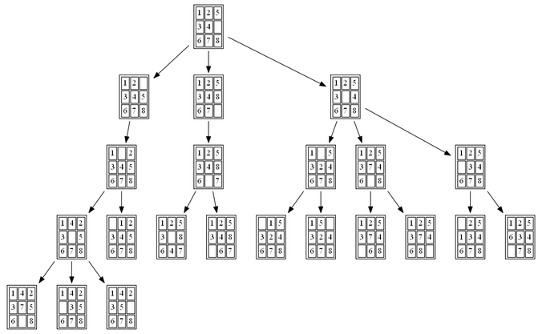

# Project - 8 puzzle solver

<em>8 Puzzle game</em>

## Dependencies
python 3.5
numpy
argparse

## Algorithm
The script uses the Brute Force Search Algorithm to find the Goal

<em>BFS Tree Seaarch</em>

## Execution

Open the terminal and move to the folder where the solver.py is located. Give the command as following:
`python  solver [input_sequence]`

example command:
`python3 solver.py 2,3,6,1,5,0,4,7,8`

## Results
The output generates three text files `nodes_info.txt` , `nodes_list.txt` , `nodes_path.txt`

`nodes_info.txt` - All the nodes info

`nodes_list.txt` - All the nodes that are explored

`nodes_path.txt` - Path to reach the goal
