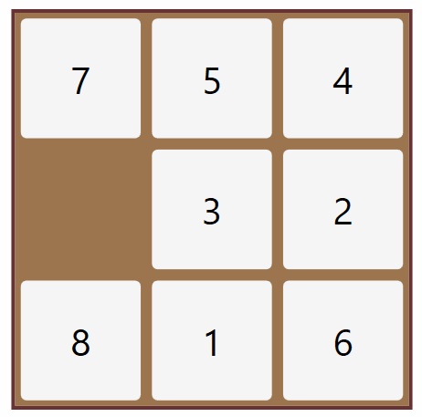

# Project - 8 puzzle solver

<em>8 Puzzle game</em>

## Dependencies
python 3.5
numpy
argparse

<em>BFS Tree Seaarch</em>

## Execution

Open the terminal and move to the folder where the solveer.py is located. Give the command as following:
python  solver [input_sequence]

example command:
python solver.py 2,3,6,1,5,0,4,7,8

the output generates three text files with all the nodes info, the nodes list and the node path to reach the goal
